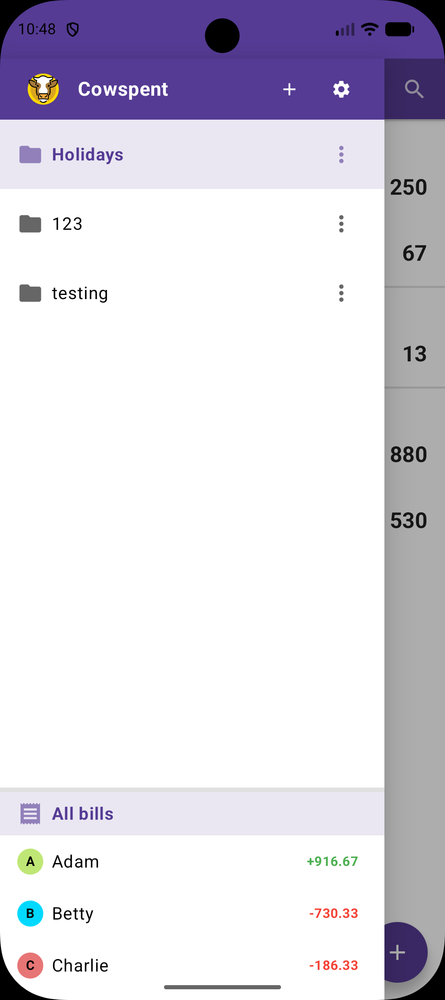
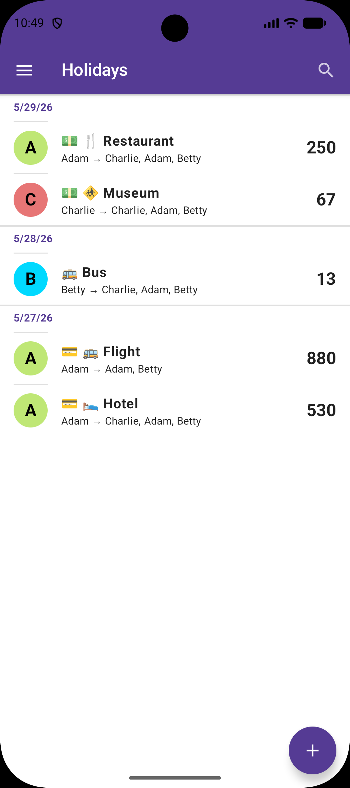
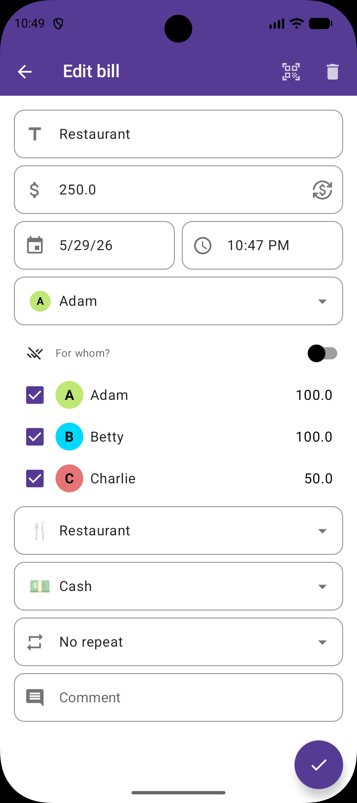
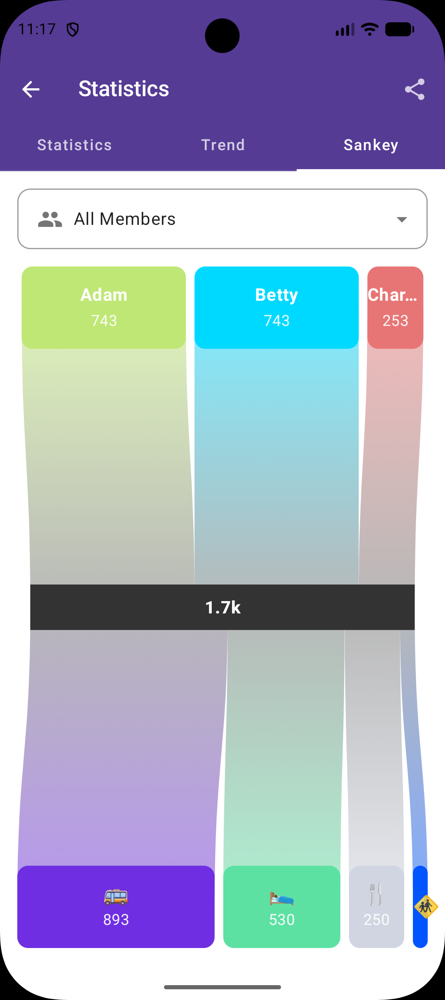
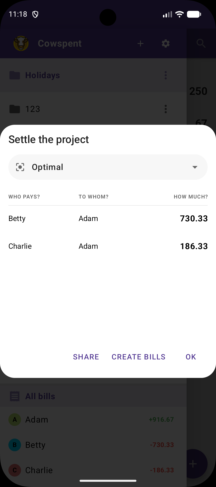
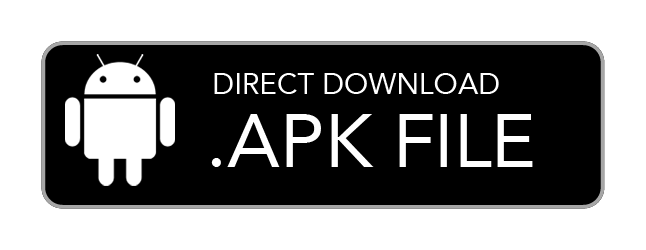

<!--suppress ALL -->
<div align="center">
  <h1>Cowspent</h1>
  

  <p>
  
Shared budget manager able to sync with [Nextcloud Cospend](https://github.com/julien-nc/cospend-nc).

This work is based upon [MoneyBuster](https://gitlab.com/eneiluj/moneybuster).
Which is originally a fork of [PhoneTrack-Android](https://gitlab.com/eneiluj/phonetrack-android/).
Which is itself a fork of [Nextcloud Notes for Android](https://github.com/stefan-niedermann/nextcloud-notes).
Many thanks to their developers :heart: !


</p>

<a href="https://ko-fi.com/I2I615VP5M"></a>
<br>


<br>
<a href="https://github.com/helcel-net/cowspent/actions/workflows/build.yml">

</a>
</div>

## 🌄 Screenshots

<div align="center">
  <table>
    <tr>
      <td style="width: 20%; height: 100px;"></td>
      <td style="width: 20%; height: 100px;"></td>
      <td style="width: 20%; height: 100px;"></td>
      <td style="width: 20%; height: 100px;"></td>
      <td style="width: 20%; height: 100px;"></td>
    </tr>
  </table>
</div>

## ⭐ Features

- manage projects (add/remove/create/delete/edit)
- manage members (add/remove/edit)
- manage bills (add/remove/edit)
- search bills (by ~~payer~~, name, ~~amount~~, ~~date~~) - **still WIP**
- project statistics (Table, Graph and Sankey) with sharing
- project settlement plan with sharing
- dark theme and customizable main app color
- share/import projects with link/QRCode

Extra Features:

- Custom Split of bills
- Support for Cospend archived-status (hide archived projects by default)
- Modern UI and code with Kotlin and Jetpack-Compose


## 📳 Installation

<div style="display: flex; justify-content: center; align-items: center; flex-direction: row;">
    <a href="https://apt.izzysoft.de/fdroid/index/apk/net.helcel.cowspent">
        
    </a>
    <a href="https://github.com/helcel-net/cowspent/releases/latest">
        
    </a>
</div>

## ⚙️ Permissions

- `CAMERA`: recommended for scanning barcodes from camera
- `INTERNET` and `ACCESS_NETWORK_STATE`: necessary for synchronization with Cospend/IHateMoney servers
- `GET_ACCOUNTS` necessary to log in with the Nextcloud account for Cospend

## 📝 Contribute

Cowspent is a user-driven project. We welcome any contribution, big or small.

- **🖥️ Development:** Fix bugs, implement features, or research issues. Open a PR for review.
- **🍥 Design:** Improve interfaces, including accessibility and usability.
- **📂 Issue Reporting:** Report bugs and edge cases with relevant info.
- **🌍 Localization:** Translate if it doesn't support your language.

## ✏️ Acknowledgements

Thanks to all contributors, the developers of our dependencies, and our users.

## 📝 License

```
Copyright (C) 2026 Helcel

Cowspent Logo made with OpenMoji Asset under CC BY-SA 4.0 <https://creativecommons.org/licenses/by-sa/4.0/>

This program is free software: you can redistribute it and/or modify
it under the terms of the GNU General Public License as published by
the Free Software Foundation, either version 3 of the License, or
(at your option) any later version.

This program is distributed in the hope that it will be useful,
but WITHOUT ANY WARRANTY; without even the implied warranty of
MERCHANTABILITY or FITNESS FOR A PARTICULAR PURPOSE.  See the
GNU General Public License for more details.

You should have received a copy of the GNU General Public License
along with this program.  If not, see <https://www.gnu.org/licenses/>.
```
